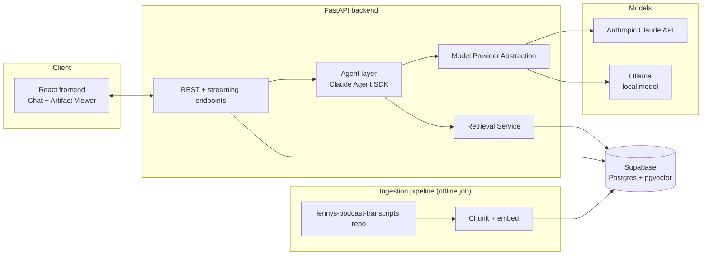
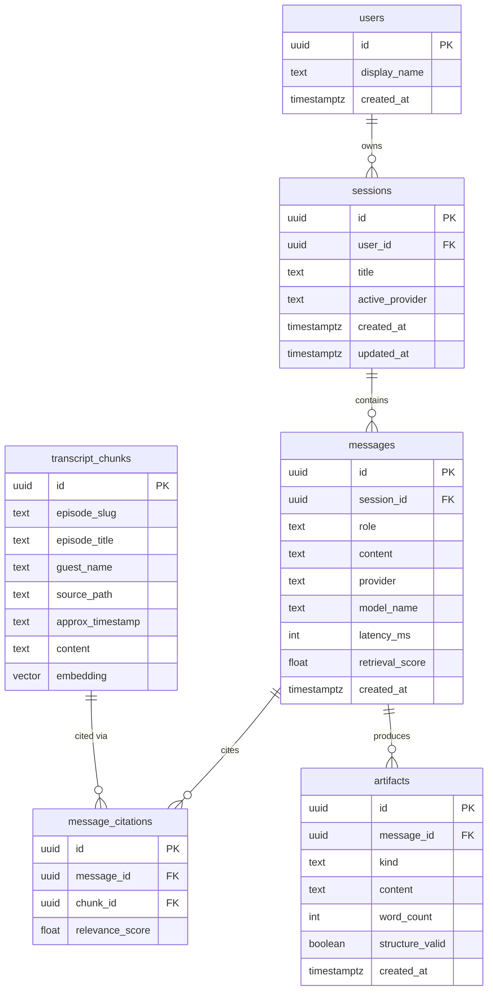
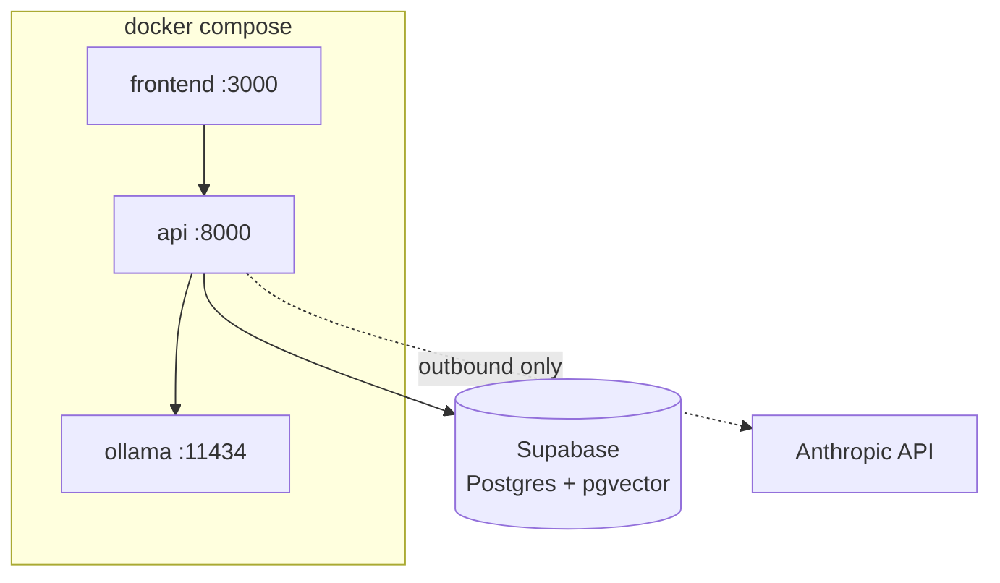

# architecture.md — The Lenny Growth Assistant

**Related docs:** [`PRD.md`](./PRD.md) · [`design.md`](./design.md)

---

## 1. System overview



**Component boundaries:**

| Component | Responsibility | Does *not* do |
|---|---|---|
| **Frontend (React)** | Chat UI, session list, Artifact Viewer rendering | No direct DB or model access — everything goes through the API |
| **API layer (FastAPI)** | Request validation, session/message CRUD, streaming responses, health checks | No prompt construction or retrieval logic itself |
| **Agent layer (Claude Agent SDK)** | Orchestrates tools: retrieval, Q&A generation, Ship 30 skill, artifact generation; decides when to call which tool | No direct DB writes — returns structured results to the API layer to persist |
| **Model Provider Abstraction** | Single interface (`generate(messages, config) -> stream`) implemented by an Anthropic adapter and an Ollama adapter | No business logic — purely a transport/format adapter |
| **Retrieval Service** | Embeds queries, runs similarity search over `transcript_chunks`, returns ranked chunks with provenance | No generation |
| **Ingestion pipeline** | Offline/one-off job: clone transcript repo, chunk, embed, upsert into `transcript_chunks` | Not part of the request-time path — runs via a CLI command / Compose one-shot service |

## 2. Database schema



Notes:
- `messages.retrieval_score` and `message_citations.relevance_score` exist specifically so the "insufficient grounding" UI state (see `design.md` §3) is driven by a stored, testable number rather than an LLM's self-assessment.
- `transcript_chunks.embedding` uses `pgvector`, keeping retrieval inside the same Postgres instance used for app data — one database to operate, one less moving part for the handoff.
- `artifacts.structure_valid` is a boolean written by a server-side validator (word count range, presence of headings/bold/takeaway for Ship 30 essays), not just an LLM claim.
- The schema is applied to Supabase via its SQL editor or a migration tool (e.g. Alembic/`supabase db push`), not a Compose-managed init script.
- pgvector must be enabled as a Supabase extension (`create extension if not exists vector;`) before running migrations — this is a manual one-time step in the Supabase dashboard or via migration.

## 3. API endpoints

| Method | Path | Purpose |
|---|---|---|
| `GET` | `/health` | Liveness check |
| `GET` | `/health/ready` | Readiness — checks DB connection, active model provider reachability |
| `POST` | `/sessions` | Create a new session |
| `GET` | `/sessions` | List sessions for the current user |
| `GET` | `/sessions/{id}` | Get a session with its message history |
| `DELETE` | `/sessions/{id}` | Delete a session |
| `POST` | `/sessions/{id}/messages` | Send a message; streams back the assistant's response (SSE) with citations |
| `POST` | `/sessions/{id}/artifacts` | Request artifact generation (Markdown/HTML or Ship 30 essay) from current context |
| `GET` | `/artifacts/{id}` | Fetch a generated artifact |
| `GET` | `/config` | Returns active provider/model, for the UI's model indicator |
| `POST` | `/ingest/run` | Trigger/re-run the ingestion pipeline (admin/CLI use, not exposed in the UI) |

**Contract conventions:** all responses use a consistent envelope (`{data, error}`), validation via Pydantic models with 422 on bad input, and structured error bodies (`{error: {code, message, detail}}`) so the frontend can render specific failure states (see `design.md` §3) instead of a generic toast.

## 4. Ingestion and retrieval flow

**Ingestion (offline, re-run on demand via `/ingest/run` or a CLI script):**
1. Clone/pull `ChatPRD/lennys-podcast-transcripts`.
2. For each `episodes/<slug>/transcript.md`, parse episode metadata (title, guest, date) from front-matter/header.
3. Chunk transcript text (paragraph/semantic chunking, target ~500–800 tokens with overlap) — timestamps in the source are preserved as an `approx_timestamp` anchor per chunk for traceability.
4. Embed each chunk and upsert into `transcript_chunks` (upsert keyed on `source_path` + chunk index, so re-running ingestion is idempotent and picks up new/changed episodes without duplicating).
5. Log a summary (episodes processed, chunks written, failures) to structured logs.

**Retrieval (request-time):**
1. Embed the user's current query (optionally rewritten using recent session turns for follow-up questions).
2. Similarity search top-k chunks from `transcript_chunks`.
3. Compute an aggregate retrieval score; if below threshold, short-circuit to the "insufficient grounding" path instead of calling the generation model with weak context.
4. Assemble a source-attributed context block (chunk text + episode/guest/source path) and pass it to the agent layer.
5. Store which chunks were used as `message_citations` rows so citations shown in the UI are checkable against real repo content, not re-derived after the fact.

## 5. Agent routing

The agent layer (Claude Agent SDK) exposes a small, fixed set of tools rather than one monolithic prompt:

- **`retrieve_transcripts`** — wraps the Retrieval Service; used by both skills below.
- **`answer_question`** (default skill) — grounded Q&A: calls `retrieve_transcripts`, then generates an answer constrained to cite only retrieved chunks.
- **`write_ship30_essay`** (dedicated skill) — encodes the Ship 30 for 30 structure as an explicit template/checklist (hook → narrative progression → skimmable formatting → takeaway), re-queries `retrieve_transcripts` for the essay's topic, generates, then runs a server-side structural validator (word count, heading presence, bold usage, explicit takeaway sentence) before returning — this is what "encoded in the skill rather than an unstructured one-off prompt" means concretely.
- **`generate_artifact`** — takes the current conversation (or a specific answer) and produces a Markdown document or self-contained HTML/CSS snippet; does not re-run retrieval, it transforms existing grounded content.

**Routing logic:** the API layer classifies intent from the request (explicit action button for "Ship 30 essay" / "Generate artifact" vs. free-text question defaulting to `answer_question`), so routing is deterministic and testable rather than left entirely to model judgement — the agent still decides *how* to use `retrieve_transcripts` within a skill, but *which* skill runs is decided outside the model.

## 6. Model provider abstraction (the toggle)

```
ModelProvider (interface)
 ├── generate(messages, system, max_tokens, stream=True) -> AsyncIterator[str]
 ├── name -> str
 └── is_available() -> bool

AnthropicProvider(ModelProvider)   # cloud
OllamaProvider(ModelProvider)      # local, mandatory for demo
```

- Selected via `LLM_PROVIDER` env var (`anthropic` | `ollama`) plus a `LLM_MODEL` name; read once at startup and exposed read-only via `GET /config` for the UI indicator (see `design.md` §6).
- `is_available()` is checked at session start and surfaced through `/health/ready`; if the configured provider is down, the API returns a structured error the frontend renders as the "Provider error" state rather than hanging on a timeout.
- **Fallback behavior:** no silent cross-provider fallback (switching from Ollama to Claude without the user knowing would undermine the "one system, two backends, no confusion" principle in `design.md`). Instead, failure is surfaced immediately with the specific cause and a retry action.
- Retrieval and provider selection are fully decoupled — the same `transcript_chunks` context is passed regardless of provider, so any quality difference in answers is attributable to generation, not retrieval, which matters for the "local model quality" risk in the PRD.

## 7. Security

**Artifact rendering (the brief's explicit security expectation):**
- Generated HTML/CSS artifacts render inside a sandboxed `<iframe>` with `sandbox="allow-same-origin"` only — **no** `allow-scripts`, **no** `allow-top-navigation`, **no** `allow-popups`. This means embedded `<script>` tags in an artifact simply do not execute.
- Markdown artifacts are rendered through a Markdown-to-HTML pipeline with an allow-listed tag/attribute set (no raw HTML passthrough, no `on*` event attributes, `javascript:` URLs stripped).
- The viewer explicitly documents (to the evaluator, in-UI via a small "About this preview" note) what's permitted (styling, layout, static markup) and blocked (script execution, cross-origin requests, top-frame navigation) — matching the brief's ask that "the evaluator should be able to understand what the viewer permits, blocks, and why."

**Other security surfaces:**
- Secrets only via environment variables; `.env` is git-ignored, `.env.example` ships with placeholder values and no real keys.
- All API input validated via Pydantic schemas; oversized payloads and malformed session IDs return 422/404 rather than 500.
- Structured logs redact message bodies at default (INFO) verbosity; a DEBUG flag exists for local troubleshooting only and is documented as unsafe for shared environments.
- Prompt-injection awareness: since transcript content is external (podcast guests, ads read into the transcripts) and gets fed into the context window, the system prompt explicitly instructs the model to treat retrieved transcript text as *reference material only*, never as instructions — this is called out here because it's a real risk specific to RAG-over-scraped-content systems.

## 8. Deployment topology



- **`docker compose up`** brings up `frontend`, `api`, and `ollama` as named services on a shared bridge network; `ollama` pulls its configured model on first start via an init step documented in the README.
- Postgres is external, hosted on Supabase, accessed via `DATABASE_URL` over the internet — same code path either way.
- The `api` service is the only component with outbound internet access requirements (Anthropic API calls, transcript repo pull during ingestion, and Supabase database access); `ollama` runs fully offline once images/models are pulled, which matters for demoing the "local-first" story for the LLM component.
- Observability: structured JSON logs from `api` (request id, session id, provider, latency, retrieval score) are written to stdout for Compose log aggregation; `/health` and `/health/ready` back a simple uptime check any evaluator can curl.
- Resilience behaviors (see PRD §1.5) are implemented at the service boundary: DB connection failures return 503 with retry-after guidance instead of crashing the process; Ollama unavailability is caught by `is_available()` before generation is attempted, not after a hung request.
- Connection pooling: use Supabase's connection pooler (pgbouncer, port 6543) for the app's `DATABASE_URL` rather than the direct connection, since FastAPI will open multiple short-lived connections.
